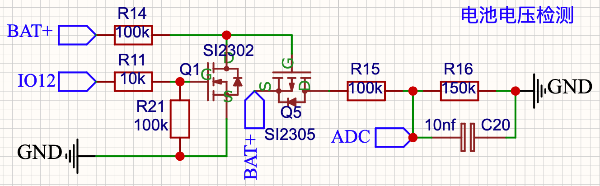

# 墨水屏雅思单词卡 · E‑Ink IELTS Word Card

[](LICENSE)

> #### 一个纯离线、超低功耗的背单词小设备
> **ESP8266 (ESP‑12S) + 2.13" 墨水屏**。不联网、不扰屏、一整块锂电撑很久。刷一张词卡 = 单词 + 音标 + 中文释义 + 电量 + 轮次页码，每 60 秒自动换一张。

---

## 为什么做这个

市面上的背单词工具要么联网、要么用 OLED/LCD 亮到晃眼、要么耗电撑不了多久。这个项目把一台**真正离线**的墨水屏设备做到极简：它从不打开 BLE/WiFi/任何射频，专注做好一件事——在你想看的时候，用护眼的墨水屏安静地给你一张词卡。深睡功耗 + 60 秒刷词节奏，一块 1S 锂电池能用很久，适合通勤、睡前、碎片时间。

## 特性

- **纯离线零联网**：从不启用 BLE / WiFi / 射频，无隐私顾虑、无干扰、无待机耗电。
- **超低功耗**：深睡（`ESP.deepSleep`）60s 定时自动刷词，刷完立即深睡；`RST`(SW4) 手动刷，一次按下 = 一个词。
- **快刷为主**：每次快刷显示（~0.5s，轻微残影），每 10 次全刷清残影（`FULL_EVERY=10`）；开机首词强制全刷，保证干净。
- **词库放 flash 不占 RAM**：约 5040 条雅思词库存于 PROGMEM（所有读取走 `pgm_read_byte`，适配 ESP8266 的 32 位 flash 访问）。
- **断电保持进度**：轮次/计数用 RTC 内存 + LittleFS 双重保持，掉电不丢当前进度（每 10 次写一次，省 flash 磨损）。
- **三款墨水屏可切换**：同一接线、同一个固件，改一个宏即可换屏 —— HINK‑E0213A04‑G01（IL3895，默认）/ SSD1680 / 三色 GDEY0213Z98。
- **电池电量采样**：IO12 使能的 N‑MOS 分压（1S 锂电 → 0–1V ADC），右上角 5 段电量图标、右下角 `R<轮> <本轮>/<词库>` 页码。
- **单中文字体**：统一使用 wqy14（文泉驿微米黑），兼顾 flash 预算与可读性。

## 屏显内容

横屏 250×122（rotation 3）布局：

```
┌────────────────────────────────┐
│  word  /ˈwɜːd/    ▁▃▅▇  电量  │  ← 单词 + 音标 | 右上电量图标
│────────────────────────────────│
│  n. 单词；话语；消息            │  ← 中文释义（UTF‑8 换行）
│  n. 诺言；命令                 │
│                                │
│            R1  128/5040        │  ← 轮次/页码（右下）
└────────────────────────────────┘
```

## 硬件

| 部件 | 型号/说明 |
|---|---|
| 主控 | ESP‑12S 模组（ESP8266，4MB flash） |
| 屏 | 2.13" 250×122 墨水屏，**默认 HINK‑E0213A04‑G01（IL3895）** |
| 电池 | 1S 锂电（ZH1.5‑2P 座） |
| 充电 | TP4054 |
| LDO | RT9013‑33GB（3.3V） |
| 电池采样 | IO12 使能 N‑MOS 分压（≈×1/5.7 → 0–1V ADC） |
| 按键 | 上键 SW2（IO0，下一个词）+ 唤醒键 SW4（RST） |
| GPIO | 11 个全部专用（屏 6 + 屏控 2 + 电池采样 + 上键 + UART0），**无富余脚** |

原理图（v2.1，2026‑08‑25）：点击查看 [**`SCH_单词卡原理图_v2.1_2026-08-25.pdf`**](SCH_单词卡原理图_v2.1_2026-08-25.pdf)

电量检测电路（`电量检测.png`）：



> 完整引脚映射、电源树、电池检测原理与移植指引见 [`docs/hardware.md`](docs/hardware.md)。

## 快速开始（构建与烧录）

使用 [PlatformIO](https://platformio.org/)，4MB flash 模组 + `huge_app.csv` 大分区（词库 ~247KB，flash 预算约 94%）：

```sh
pio run -e esp8266            # 编译
pio run -e esp8266 -t upload  # 烧录
pio device monitor            # 串口监视（74880，对齐 boot ROM）
```

烧录通过 USB‑TTL 接到 6P 烧录焊盘（GND / 3V3 / GPIO0 / RST / TXD / RXD）。板子没有板载 CH340，需外接 USB‑TTL；PlatformIO/esptool 会通过 RTS 自动进下载模式，**无需断开任何器件**。

## 词库（生成管线）

`src/dict_ielts.h` 是**生成文件，不要手改**。词表来自 [ECDICT](https://github.com/skywind3000/ECDICT) 的 `ecdict.csv`，改词表 = 改 ECDICT 数据或生成器，然后重新生成：

```sh
python3 tools/gen_dict_h.py --level ielts --out src/dict_ielts.h
# 其它级别：cet4 / cet6 / ky / gk
```

每行格式 `word|phonetic|meaning`：`|` 分隔字段，`\n` 为字面转义（固件解析时还原换行），IPA 已按 U8g2 字体能力转为 ASCII 近似（`æ→ae`、`θ→th` …）。

## 屏幕驱动切换

在 `src/word_cards.cpp` 顶部改宏：

| 宏 | 屏幕 |
|---|---|
| `USE_Z98C = 1` | 三色屏 GDEY0213Z98（红/黑/白；无快刷，全刷 ~15s） |
| `USE_SSD1680 = 1` | SSD1680（`GxEPD2_213_B74`，**快刷最佳**：全刷 1.9s、对比好） |
| 均 `0`（默认） | HINK‑E0213A04‑G01 IL3895（`GxEPD2_213_HINK`，自定义类 `src/hink_e0213.*`，VCOM 0x2C=0x18 实测调参） |

> 各屏实测对比、驱动 IC 识别与调参记录见 [`docs/ink_displays.md`](docs/ink_displays.md)。

## 目录结构

```
eink-vocabulary-card/
├── data/
│   └── words_demo.txt          # 演示词表（与生成词库同格式）
├── docs/
│   ├── BOM.csv / bom.md        # 物料清单（手工焊接版）
│   ├── hardware.md             # 完整硬件参考（引脚/电源/电池检测/移植指引）
│   └── ink_displays.md         # 各型墨水屏实测
├── src/
│   ├── word_cards.cpp          # ★ ESP8266 固件（主程序）
│   ├── word_cards_ref.cpp      #   ESP32 参考（行为基准，esp8266 构建已排除）
│   ├── hink_e0213.cpp / .h     #   HINK‑E0213A04‑G01 IL3895 驱动类
│   ├── dict_ielts.h            #   生成的雅思词库（勿手改）
│   ├── screen_test.cpp         #   屏幕测试
│   └── u8g2_fonts_flash.h      #   flash 内字体读取适配（pgm_read_byte）
├── tools/
│   ├── gen_dict_h.py           # 词库生成器（读 ECDICT）
│   └── serial_log.py           # 串口日志采集
├── LICENSE                     # MIT
├── platformio.ini              # ESP8266 构建配置
├── SCH_单词卡原理图_v2.1_2026-08-25.pdf
└── 电量检测.png
```

## 关联项目

这个仓库是单词卡的主线，同系列的其它设备由同一平台演进而来：

- [eink-driver-test](https://github.com/oomhj/eink-driver-test) — 墨水屏型号探针/实验（`ink-driver-test` 分支独立而来）
- [eink-album](https://github.com/oomhj/eink-album) — 墨水屏相册（`photo-album` 分支独立而来）
- [eink-calendar](https://github.com/oomhj/eink-calendar) — 墨水屏每日日历（`daily-calendar` 分支独立而来）

## 文档

- [`docs/hardware.md`](docs/hardware.md) — 完整硬件参考（引脚图、电源树、电池检测原理、ESP8266 移植指引）
- [`docs/ink_displays.md`](docs/ink_displays.md) — 各型号墨水屏实测对比与调参记录
- [`CLAUDE.md`](CLAUDE.md) — 面向 AI 助手的工程说明（构建细节、架构、注意事项）

## 第三方库与数据

- [GxEPD2](https://github.com/ZinggJM/GxEPD2) — 墨水屏驱动（`zinggjm/GxEPD2`）
- [U8g2_for_Adafruit_GFX](https://github.com/olikraus/U8g2_for_Adafruit_GFX) — 中文/UF8 字体渲染
- [ECDICT](https://github.com/skywind3000/ECDICT) — 开源英汉词典数据（词库来源）
- 文泉驿微米黑（wqy14）— 中文字体数据

## 许可证

本项目代码采用 [MIT 许可证](LICENSE)。

Copyright (c) 2026 PonyMa
